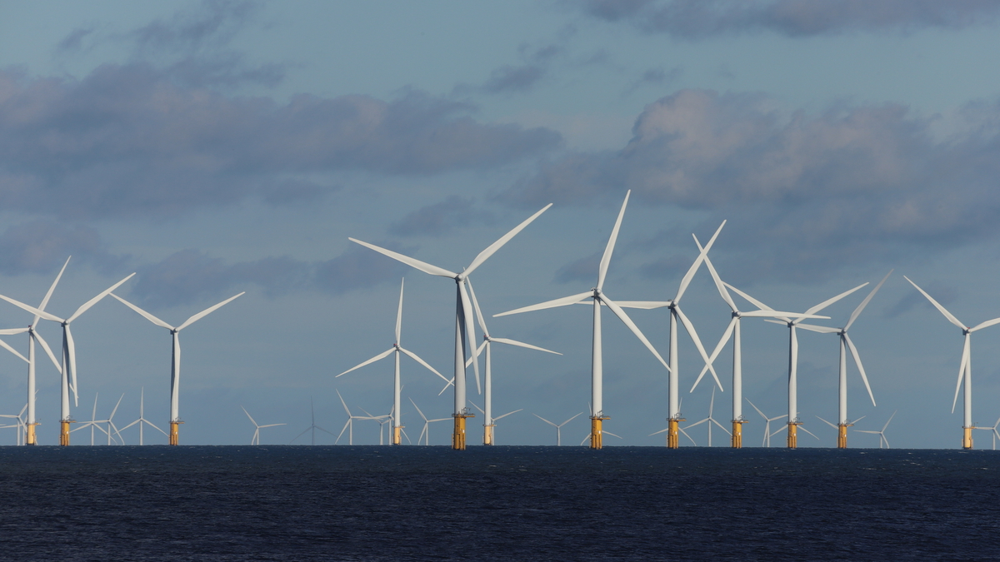
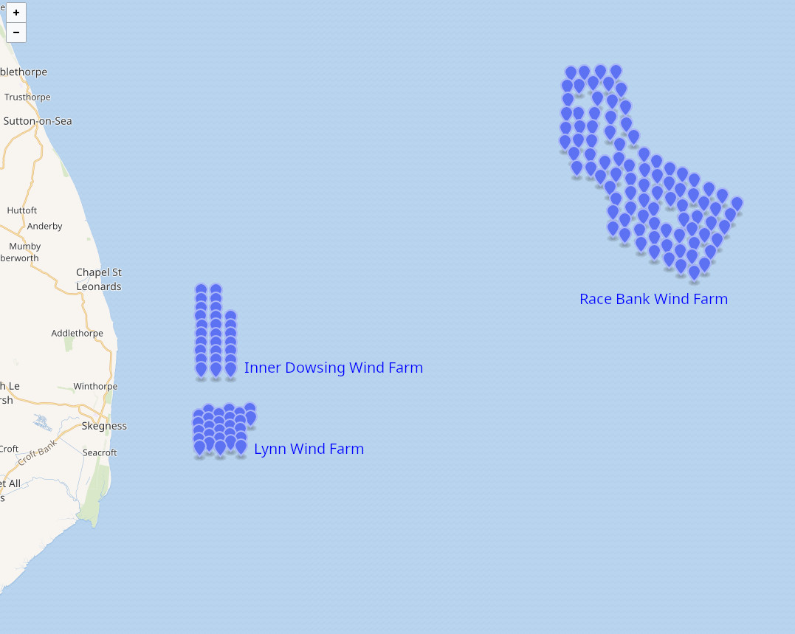
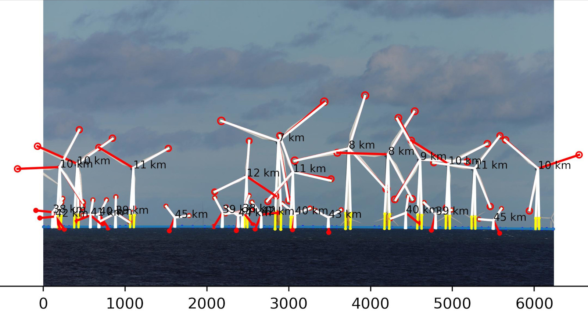
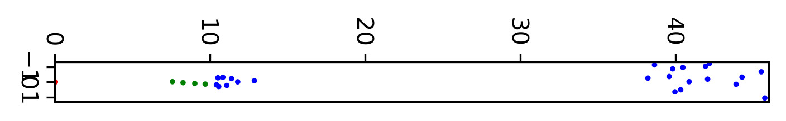
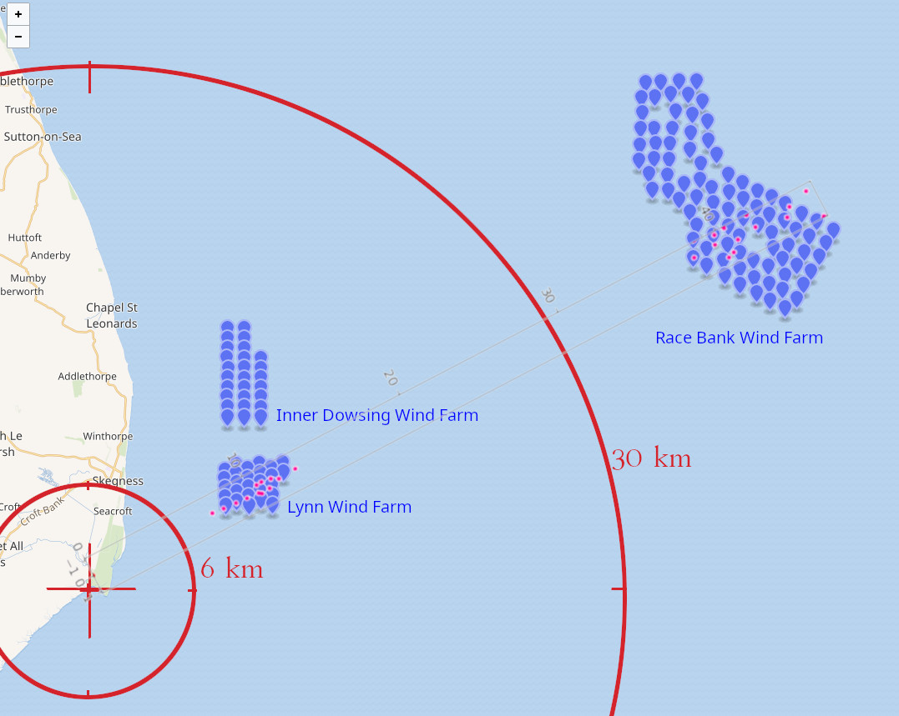
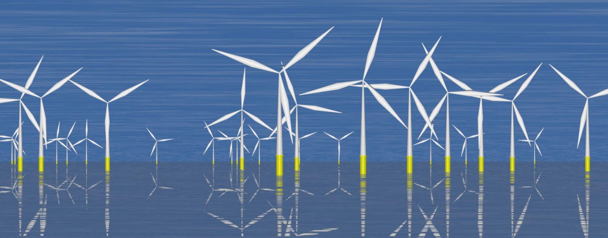
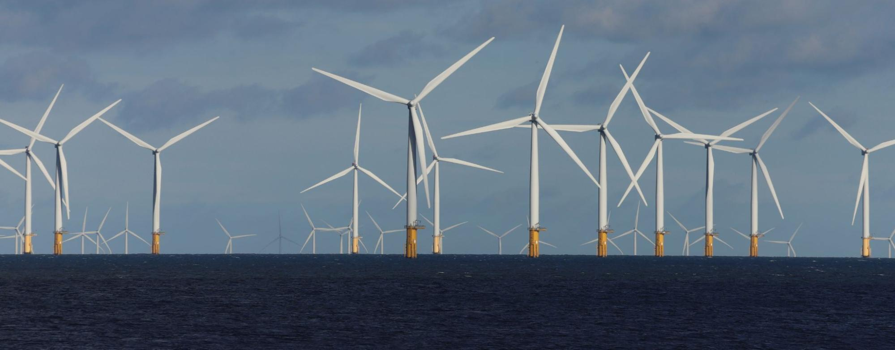
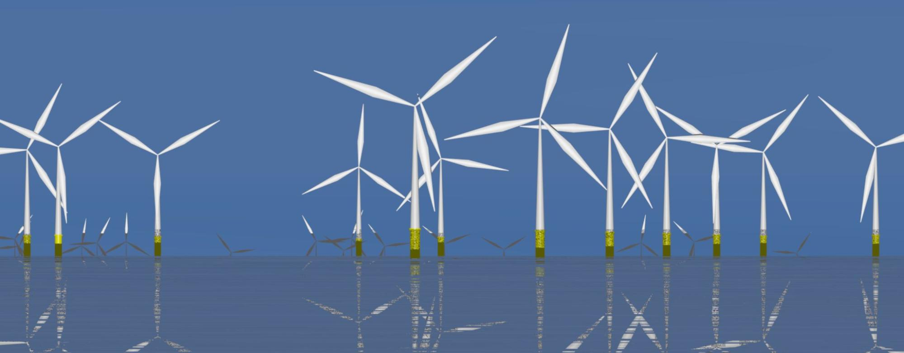

# Lynn windfarm pictures analysis

## Goal

Analysing https://www.flickr.com/photos/37012317@N08/51664909026/ to disqualify (once again) flat Earth fallacies.


Figure 0: Thye picture we'll analyse (reduced in size). Credit: [Neil Storey](
    https://www.flickr.com/photos/37012317@N08/)

## Method
We have to do:
- Photogrammetry: measuring object pixel size on the image
- Georeferencing: finding the location of the object in the image
- Geolocation: finding the location of the camera
- Reconstructing the scene

## Photogrammetry

### Basic data
First, some basic data on the image:
Exif:
```
File name       : 51664909026_2877f487d2_o.jpg
File size       : 10955414 Bytes
MIME type       : image/jpeg
Image size      : 6240 x 3510
Thumbnail       : image/jpeg, 6053 Bytes
Camera make     : Canon
Camera model    : Canon EOS 6D Mark II
Image timestamp : 2021:10:30 15:08:54
File number     : (0)
Exposure time   : 1/320 s
Aperture        : F16
Exposure bias   : -1/3 EV
Flash           : No, compulsory
Flash bias      : 0 EV
Focal length    : 600.0 mm
Subject distance: 0 m
ISO speed       : 200
Exposure mode   : Shutter priority (Tv)
Metering mode   : Spot
Macro mode      : Off
Image quality   : Superfine
White balance   : Daylight
Copyright       : 
```

Camera body:
```
Canon EOS 6D Mark II
Captor size: 35.9 × 24.0 mm2 / 6240 × 4160 pixels
```
So the image we have here has been cropped, veritically but not horizontally.

We'll assume that the pixel size hasn't been altered (only crop, no resize), which is likley, and that the image is centered (which should be about correct).


### Pixel size

The pixel size can be computed from pixel count and the sensor size:
$$px=\frac{s}{p}$$

Where:
- $s$ is the sensor size (in mm)
- $p$ is the number of pixels

Numerically:
$$pxx=\frac{35.9}{6240}=5.75μm$$
$$pxy=\frac{24.0}{4160}=5.77μm$$

The pixels are likley squares, but some dead border likley exists on the sensor, we'll take $$px=5.76μm$$ as a good approximation.

### Pixel size of objects with convertion to actual size

#### Crude approximation

We'll start from the simple relation:

$$α=2×\tan^{-1}\left(\frac{l}{2f}\right)$$

Where:
- $f$ is the focal length of the lens (in mm)
- $l$ is the distance (in mm) measured on the sensor
- $α$ is the angle (in radians) of the measured object

This relation is exact only for objects spanning equaly from sensor center. We'll assume it's good enough as the focale is long enough (so the angles are small).


If we reverse the above relation, we'll get:

$$l=2f\tan\left(\frac{α}{2}\right)$$


## Location


Figure 1: Map of the windfarms

The two involved windfarms in this picture are the Lynn windfarm and the Race Bank windfarm.

### Lynn windfarm
Basic data:
https://en.wikipedia.org/wiki/Lynn_and_Inner_Dowsing_Wind_Farms

The farm was completed in 2009, so the picture in 2021 shows a completed farm.

The wind turbine are SWT-3.7-107:
https://en.wind-turbine-models.com/turbines/1272-siemens-swt-3.6-107-offshore

Diameter: 107.0 m

The height of the windturbines is not specified, we'll have to measure them.

### Race Bank windfarm

Basic data:
https://en.wikipedia.org/wiki/Race_Bank_wind_farm

The farm was completed in 2018, so the picture in 2021 shows a completed farm.

The wind turbines are SWT-6.0-154:
https://fr.wind-turbine-models.com/turbines/657-siemens-swt-6.0-154

Diameter: 154.0 m

The height of the windturbines is not specified, we'll have to measure them.

## Reconstructing the scene

The pictures has been analysed, windmills identified on the image for further analysis (see Figure 2). Note: the used algorithm was very simple and relied on manually pointing the key points on the images before reconstruction.


Figure 2: Identified windmills and relevant items on the picture. Computed lines are supperimposed to the original photography.


### Some computed data

#### Windmill height

From picture, knowing the diameter of the Lynn windturbines, we can compute the size of the windturbines:
- Height of the Yellow part: $15 m$
- Width of the Yellow part:  $5 m$
- Height of the White part: $71 m$

Total height: 76 m

To get similar data from the Race Bank windfarm, we'll use the following pictures:
- https://www.alamy.com/the-6mw-siemens-swt-60-154-wind-turbines-on-the-race-bank-offshore-wind-farm-in-the-southern-north-sea-uk-image215430515.html
- https://www.alamy.com/wind-turbines-on-the-race-bank-offshore-wind-farm-in-the-southern-north-sea-uk-image215430497.html

On PEDKP9: Height: $380 px$, blades: $293 px$, $282 px$, $288 px$.
So, blade mean length is $bl=(293+282+288)/3=288$
Scale is $pxl=(154/2)/288=0.27 m/px$
So, height of the mast is $h=380*0.27=102 m$.

#### Windmill distance and location

From picture, knowing the size of the windturbines wings, we can compute their distances and location from viewing angle (see Figure 3).


Figure 3: Location of windmills from photogrammetry. In green, mills closer than horizon, in blue, mills further than horizon.

#### Altitude and horizon distance

Horizon distance from camera was estimated to be between $9$ and $10.5 km$ (see Figure 3).
So, altitude of the camera is between $7$ and $11 m$. For simulation, we fixed $10 m$.

#### Reconstructions limits and notes

For sure, the computed values have some errors. No attempt has been made to match the reconstructed windmill positions to the actual location on map.
Not having the location where the picture was taken makes it harder (but likely doable)

However, the global reconstruction is globally correct (see Figure 4).


Figure 4: Reconstructed windmills map over the actual map, with an attempted location of the shot.

## Povray simulation from data

Using the data above, here is a simulation of the scene, assuming flat surface, and Earth curved surface. Original image added for reference.





## Conclusion

Quite compatible with a globe, again.
